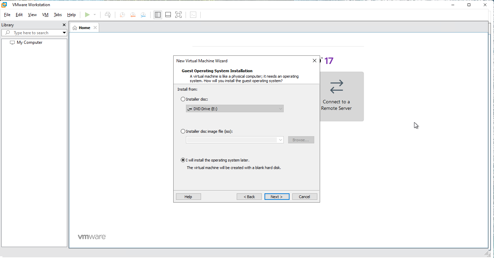

# VMware Workstation Pro on Azure VM 

🔧 Requirements of Azure VM
- **VM Size**: E or D Series with Intel Process. My case was E2ds. 
- **OS**: Windows 10 Enterprise 22H2 - V1 (generation 1) used in my case. The one available in Marketplace as recording of today 12/08/2025 
- **Hypervisor**: Hyper-V must be enabled inside the VM.

## Step 1: Create Azure VM 
Create a virtual Machine E2ds SKU, Windows 10 22h2 Enterprise Gen1, choose your preferred region. All other settings remain at their default values. Make sure to enable RDP in NSG and use public IP Standard SKU. 


## Step 2: Downloading VMware Workstation Pro

1. Visit https://support.broadcom.com and log in using your credentials. If you don’t have an account, you can create one, it is free. Alternatively, you can access the setup file directly by referring to the resources.md file in the repository. 
Click on **HERE** in Free Software Downloads available. 


2. Select from the list VMware Workstation pro. 


3. Select VMware Workstation Pro 17.0 for Windows.


4. Select the version that best suits your needs. In my case, I chose the latest available version at the time of this demonstration, which was 17.6.4.


5. Click on the download button . 


**PS: if you were not able, accept the licensing terms, then click on Download button**


## Step 3: Install VMware Workstation Pro

1. Run the EXE File after downloading it. Click on **Next**


2. Check the box "I accept the terms in the License Agreement". Click on **Next**
   


3. Ignore the info message and click on **Next**


4. Keep default values. Click on **Next**


5. Keep default values. Click on **Next**


6. Keep default values. Click on **Next**


7. Click on **Install**
   


8. Click on **Finish**
   


## Step 4: Download Windows 10 ISO / latest version

1. Navigate to https://www.microsoft.com/software-download/windows10. This page provides access to the Windows Media Creation Tool, but not the ISO file directly. In this guide, I’ll show you how to locate and download the Windows 10 ISO file.


2. Press **F12** inside Edge Navigator or Google Chrome to access Developper Tools.
   


3. Click the **Mobile button**  and then Refresh the page.


   
4. You will be to get the latest version of Windows 10. Click on **Confirm**


5. Select the product language and then click on **Confirm**


6. In the Downloads section, you can click 64-bitios Descargar. Don't worry the Windows installation will be in the language you selected in Step 5.
 


 7. The ISO will be downloaded.


## Step 5: Creating a VM inside VMware Workstation Pro

1. Click on **File** -> **Create new VM** -> Click **Next**
   


2. Select **I will install the operating system later** or you can select **Installer disc image file (iso)** -> **Browse** -> Choose the path of the downloaded iso file done in Step 4.




3.  Select **Microsoft Windows** for the Guest OS and for the Version **Windows 10 X64**. Click **Next**
   


4.  Set a Virtual Machine Name, location and then click **Next**


5.  Choose your size Disk. Click **Next**


6. Click **Finish**


7.  Power on the virtual machine. Note that even if the ISO file has not been selected, the VM can still be started. However, you will encounter an error stating that Hyper-V and VMware Workstation are not compatible. This is why I included enabling the Hyper-V role as a prerequisite. Nevertheless, I wanted to demonstrate what happens when this step is skipped and show the specific error message that appears.


## Step 6 or Step 0: Installing Hyper-V role / Fix the error message in Step 5


1. Right click on the Start Menu -> Click on **Windows PowerShell (Admin)
   


2. Run the command below.

```powershell
Enable-WindowsOptionalFeature -Online -FeatureName Microsoft-Hyper-V -All
```
Restart your VM. 


## Step 7: Power-on the VM and Install Windows 10

1. Power-On the VM. The error message has gone. 


2. If you selected in Step 5 point 2, Install later OS. Go to Virtual Machine Settings -> CD/DVD -> Use ISO image -> Select your ISO image -> Click Open -> Check the 2 check boxes inside Device Status -> Click **OK**


3.Follow instructions to Install Windows 10 


