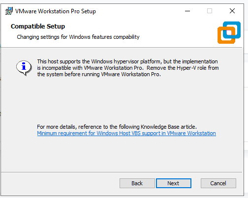

# VMware Workstation Pro on Azure VM 

🔧 Requirements of Azure VM
- **VM Size**: E Series with Intel Process. IE: E2ds, E4ds ...
- **OS**: Windows 10 Enterprise 22H2 - V1 (generation 1) used in my case. The one available in Marketplace as recording of today 12/08/2025 
- **Hypervisor**: Hyper-V must be enabled inside the VM.

## Step 1: Create Azure VM 

Note: All other settings remain at their default values. Make sure to enable RDP in NSG and use public IP Standard SKU. 

## Step 2: Downloading VMware Workstation Pro

1. Visit https://support.broadcom.com and log in using your credentials. If you don’t have an account, you can create one, it is free. Alternatively, you can access the setup file directly by referring to the resources.md file in the repository. 
Click on **HERE** in Free Software Downloads available. 

2. Select from the list VMware Workstation pro. 

3. Select VMware Workstation Pro 17.0 for Windows.

4. Select the version that best suits your needs. In my case, I chose the latest available version at the time of this demonstration, which was 17.6.4.

5. Click on the download button . 

**PS: if you were not able, accept the licensing terms, then click on Download button**

## Step 3: Install VMware Workstation Pro

1. Run the EXE File after downloading it. Click on **Next**

2. Check the box "I accept the terms in the License Agreement". Click on **Next**
   

3. Ignore the info message and click on **Next**

4. Keep default values. Click on **Next**

5. Keep default values. Click on **Next**

6. Keep default values. Click on **Next**

7. Click on **Install**
   

8. Click on **Finish**
   

   

